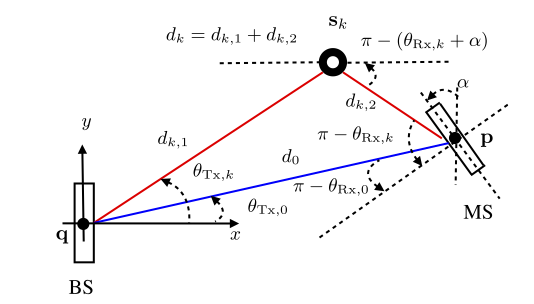

# 5GPositioning
This is a demonstration of 5G mmWave positioning

## Summary
The matlab code (main.m) generates a 2D environment with random scatterers and line-of-sight (LOS) between a transmittee (at a fixed location) and a receiver (with unknown location and orientation). Both the transmitter and receiver are equipped with uniform linear arrays (for the transmitter the ULA is aligned with the vertical axis). The transmitter sends a sequence of beams, with associated precoders, to the receiver. At the receiver, the time-of-arrival (TOA), angle-of-arrival (AOA), and angle-of-departure (AOD) are estimated using distributed compressed sensing (DCSSOMP.m) in the beamspace domain. The LOS parameters are then utilized to recover the receiver's location and orientation. 




*This figure shows the scenario with a single scattering point.*

## Main parameters
The parameters that can be set by the user are 
```
L=4;                % number of paths (including LOS)
Rs=100;             % total BW in MHz
N=10;               % number of subcarriers 
Nt=32;              % number of TX antennas
Nr=Nt;              % number of RX antennas
Nb=Nt*2;            % number of beams in dictionary; 
Ns=20;              % number of beams sent
posRx=[5 1]';       % RX (user) position, TX is assumed to be in [0, 0]
alpha=0.2;          % user orientation
sigma=0.1;          % noise standard deviation
```
Note that for the code to be able to estimate the distance, the number of subcarriers should be greater than 1. 

## What's still missing
Still to do:
1. Receiver combining: the current version assumes full access to the received waveform
2. Positioning based on the non-line-of-sight (NLOS) components: the current version only uses the LOS path for positioning and orientation estimation
3. Three dimensional: the current version is only in 2D
4. Refinement of parameter estimates: the current version is a one-shot estimation without the refinement.

## Authors

The code was developed by 
* **[Henk Wymeersch](https://sites.google.com/site/hwymeers/)**
* **[Gonzalo Seco Granados](http://spcomnav.uab.es/~gseco/)**

This code is based on the paper 

A. Shahmansoori, G. E. Garcia, G. Destino, G. Seco-Granados and H. Wymeersch, "Position and Orientation Estimation Through Millimeter-Wave MIMO in 5G Systems," in *IEEE Transactions on Wireless Communications*, vol. 17, no. 3, pp. 1822-1835, March 2018.

If you plan to use or modify this code, please cite our work: 
```
@ARTICLE{ShaGarDesSecWym:18,
author={A. Shahmansoori and G. E. Garcia and G. Destino and G. Seco-Granados and H. Wymeersch}, 
journal={IEEE Transactions on Wireless Communications}, 
title={Position and Orientation Estimation Through Millimeter-Wave MIMO in 5G Systems},
year={2018}, volume={17}, number={3}, pages={1822-1835}, 
doi={10.1109/TWC.2017.2785788}, ISSN={1536-1276}, month={March}}
```

## License

This project is licensed under the MIT License - see the [LICENSE.md](LICENSE.md) file for details
